# 미래 잔상 예측 액션

몰입캠프 3주차 · 주제 1 Build the Core · 팀 26s-w3-c3-04 (3인)
Unity 6 (6000.5.4f1) / Windows 빌드 · 기준 브랜치 `prediction-route-diversity`

> 이 문서의 모든 도식은 Mermaid입니다. 노션에서는 코드블록 언어를 `Mermaid`로 지정하면 그대로 렌더됩니다.
> 발표용으로는 **5.0 한 장 요약**만 보셔도 알고리즘 전체가 설명됩니다. 5.1 이하는 상세 내용입니다.

---

## 1. 프로젝트 소개

좁은 수직형 아레나에서 칼과 이동기만으로 적 웨이브를 상대하는 1인칭 액션입니다. 난전이 감당하기 어려워지는 순간 예지를 발동하면 시간이 멈추고, 시스템이 지금 상태에서 실제로 가능한 5초 뒤의 미래 세 갈래를 계산해 보여줍니다. 플레이어는 그중 하나를 고른 뒤, 0.5초 간격으로 놓인 잔상을 리듬처럼 따라 입력해 그 미래를 직접 실현합니다.


여기서 예지는 미리 만들어둔 연출이 아닙니다. 실제 게임 시뮬레이션을 통째로 복사해 굴려보고, 10의 24제곱 규모의 미래 공간을 Beam Search로 3,665 노드까지 줄여 수백 밀리초 안에 푸는 탐색 엔진이 이 게임의 코어입니다.

---

## 2. 기획 동기

### 2.1 난전과 패닉

둠 같은 고속 1인칭 액션을 하다 보면, 적에게 둘러싸인 순간 판단이 멈추는 구간이 옵니다. 어디로 빠져야 하는지, 지금 대시를 써야 하는지 아껴야 하는지, 저 원거리 적을 먼저 잡아야 하는지가 동시에 밀려오는데 시간은 0.5초도 주지 않습니다. 그 순간의 스트레스가 장르의 매력이기도 하지만, 동시에 진입 장벽이기도 합니다.

여기서 나온 발상이 이번 프로젝트의 출발점입니다.

> 그 난전의 순간을 **기술로** 헤쳐나갈 수 있는 장치가 액션 게임에 있으면 어떨까?

패닉의 정체는 "선택지가 너무 많은데 볼 시간이 없다"입니다. 그렇다면 시간을 멈추고, 지금 이 상태에서 실제로 가능한 선택지를 시스템이 대신 끝까지 굴려본 뒤 몇 갈래로 압축해 보여주면 됩니다. 이것이 게임 안에서는 "예지"라는 초능력이지만, 구현 관점에서는 **실시간 탐색 문제**입니다.


### 2.2 주제 선택

3주차 주제는 기술적으로 깊게 파는 Build the Core와, 제품으로 널리 퍼뜨리는 Launch and Spread 두 갈래였습니다. 저희는 전자를 골랐고, 위 발상을 그대로 기술 문제로 번역했습니다.

게임에서 미래를 보여주는 연출은 흔하지만 대부분은 미리 만들어둔 애니메이션입니다. 저희가 답하고 싶었던 질문은 이것입니다.

> 지금 이 난전 상태에서, 실제로 가능한 5초 뒤 미래를 계산해서, 플레이어가 그걸 그대로 실행할 수 있는가?

### 2.3 네 개의 기술 과제

질문 하나가 네 개의 독립된 기술 문제로 갈라졌고, 각각의 답이 그대로 이 프로젝트의 구조가 되었습니다.

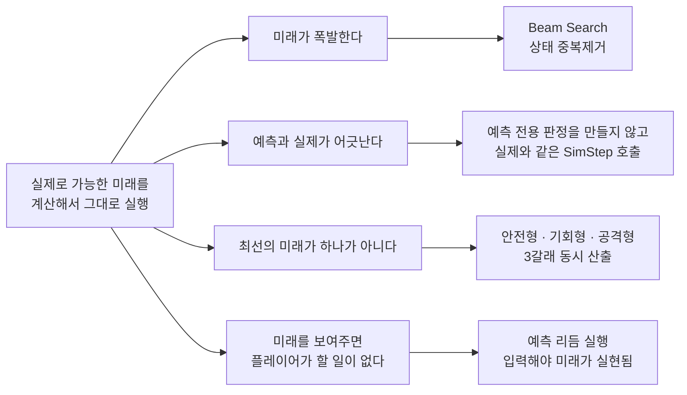

미래가 폭발합니다. 0.25초 단위로 16종 행동 중 하나를 고르며 5초를 내다보면 경우의 수가 16의 20제곱, 약 1.2×10²⁴입니다. 전수 탐색은 불가능합니다.

예측과 실제가 어긋납니다. 예측용 판정을 따로 짜는 순간 게임이 거짓말을 시작합니다. 그래서 제1원칙을 "예측 전용 판정을 새로 만들지 않는다"로 못 박았습니다.

최선의 미래가 하나가 아닙니다. 살아남는 게 최선인지 죽이는 게 최선인지는 상황과 취향의 문제이고, 정답이 하나면 선택의 재미가 사라집니다.

미래를 보여주면 플레이어가 할 일이 없어집니다. 자동 재생은 관람이지 게임이 아닙니다.

---

## 3. 핵심 기능

### 3.1 예지 · 미래 3갈래 프리뷰

예지를 켜면 시간이 멈추고 세 개의 경로가 동시에 뜹니다. 같은 탐색, 같은 점수 공식을 쓰되 버킷 배율만 다릅니다.

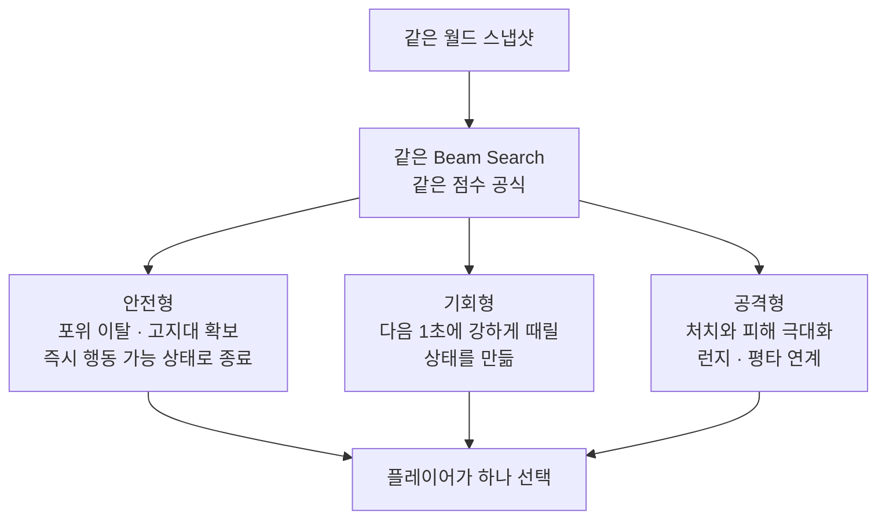

예지 게이지는 곧 탐색 깊이입니다. 게이지가 길수록 더 먼 미래를 보지만 연산량도 그만큼 늘어납니다.

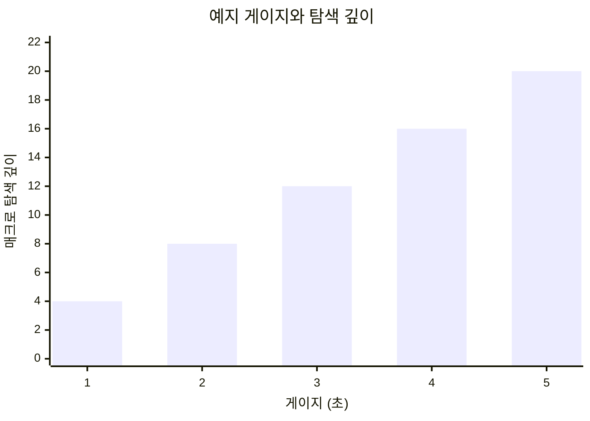

### 3.2 예측 리듬 실행

선택한 미래는 자동으로 재생되지 않습니다. 잔상 노드마다 요구 액션을 판정 창 안에 직접 입력해야 하고, 실패하면 그 시점의 실제 월드를 유지한 채 직접 조작으로 돌아옵니다.

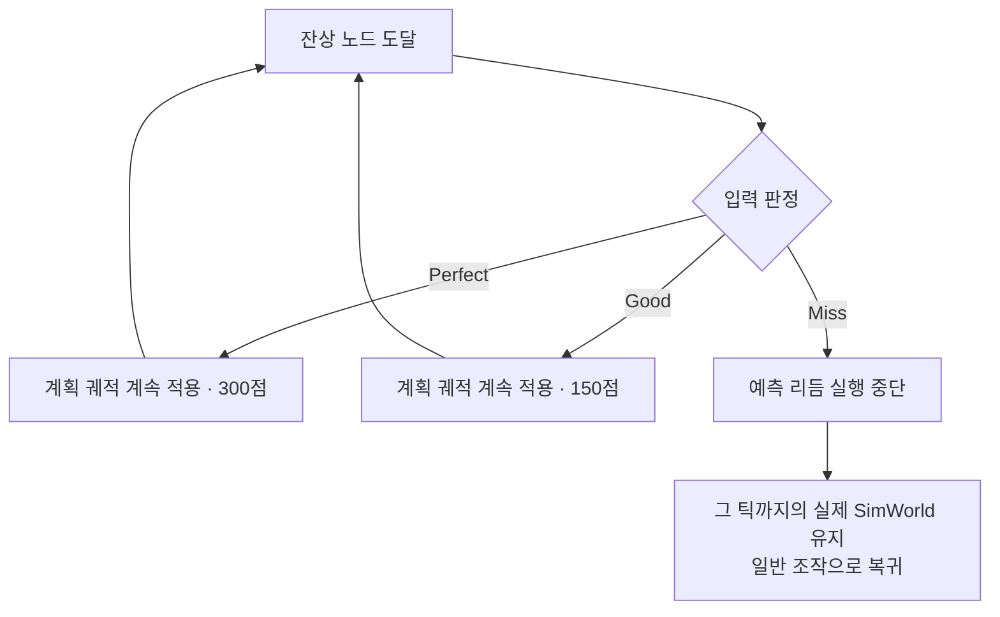

"박자 맞추기가 밋밋하다"는 피드백을 받고, 판정기와 재생 파이프라인은 그대로 둔 채 한 박자를 어떻게 치게 만드는가만 갈아끼우는 레이어를 얹어 5종 모드를 실험했습니다.

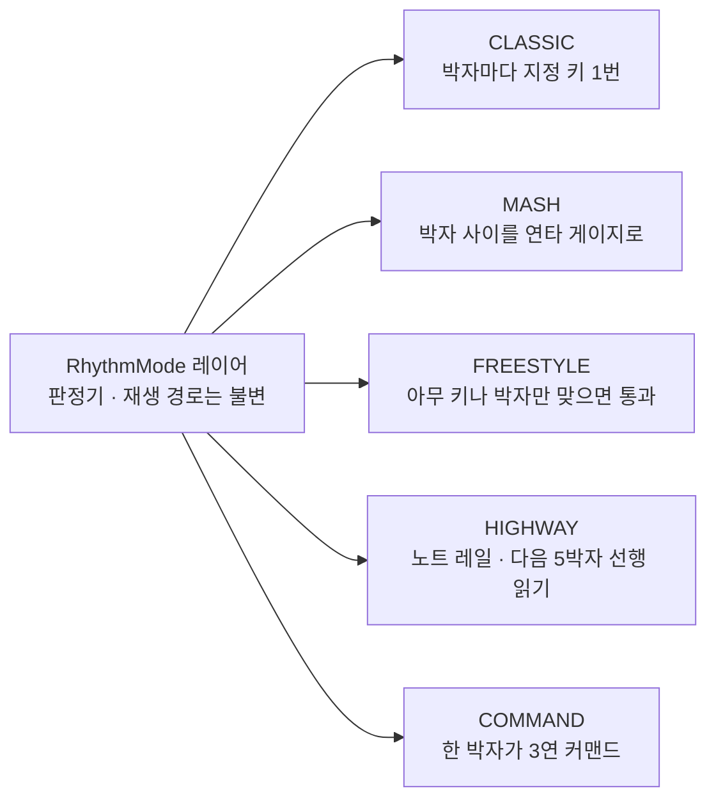

### 3.3 전투

이동은 1인칭 더블 점프와 4방향 대시, 공격은 좌클릭 평타와 우클릭 타깃 런지가 축입니다. 여기에 공중 적을 상대하는 세 가지 대공 행동이 붙습니다.

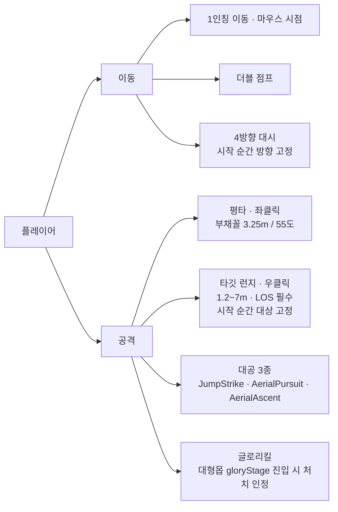

적의 모든 공격은 아래 구조를 갖습니다. Windup에서 방향이 고정되고 그 뒤로는 플레이어를 쫓지 않기 때문에, 옆으로 빠지면 반드시 빗나갑니다. 예측기가 회피 가능을 계산할 수 있는 근거가 여기에 있습니다.

```mermaid
gantt
    title 적 공격 1회의 틱 구조 (60Hz)
    dateFormat X
    axisFormat %s틱
    section 적
    Windup 24틱 · 방향 고정 · 텔레그래프  :done, w, 0, 24
    Active 6틱 · 판정 1회 · 피해 1        :crit, a, 24, 30
    Recovery 24틱 · 후딜                  :r, 30, 54
    section 플레이어
    회피 경로를 계산할 수 있는 창          :active, e, 0, 24
    이 구간에 옆으로 빠지면 확정 회피      :active, e2, 0, 30
```

### 3.4 몹 · 3축 조합

몹은 개별 N종이 아니라 세 개의 독립 축의 조합으로 설계했습니다. 이동 함수는 앞으로 계속 바뀔 게 확실했기 때문에, 바뀌어도 되는 것과 절대 지켜야 하는 것을 먼저 분리했습니다.

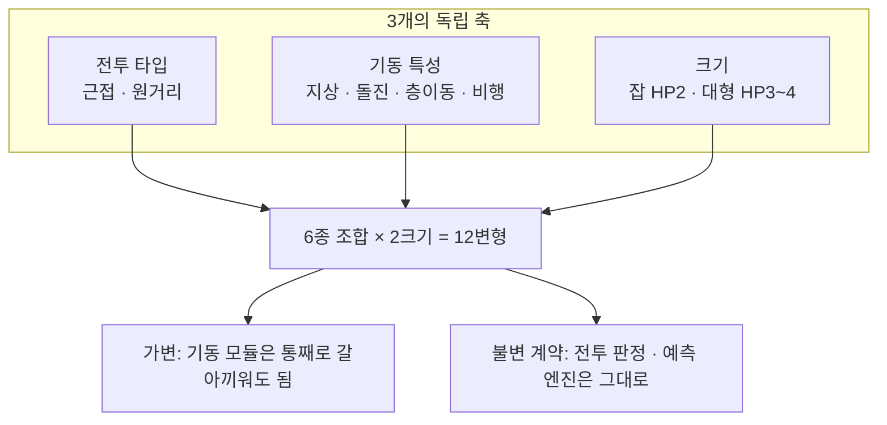

| 전투 \ 기동 | 지상 | 돌진 | 층이동 | 비행 |
|---|---|---|---|---|
| 근접 | 근접잡몹 | 돌진근접 | 층이동근접 | — |
| 원거리 | 원거리잡몹 | — | 층이동원거리 | 공중원거리 |

---

## 4. 시스템 아키텍처

### 4.1 아키텍처 구조도

의존은 한 방향뿐입니다. `Game.Sim`은 `UnityEngine` 의존이 전혀 없는 순수 결정론 코어이고, 물리와 길찾기 같은 엔진 의존은 `Ports` 인터페이스로 바깥에 두고 `Game.Bridge`가 구현합니다. 덕분에 예측기는 게임을 렌더링하지 않고도 게임을 돌려볼 수 있습니다.

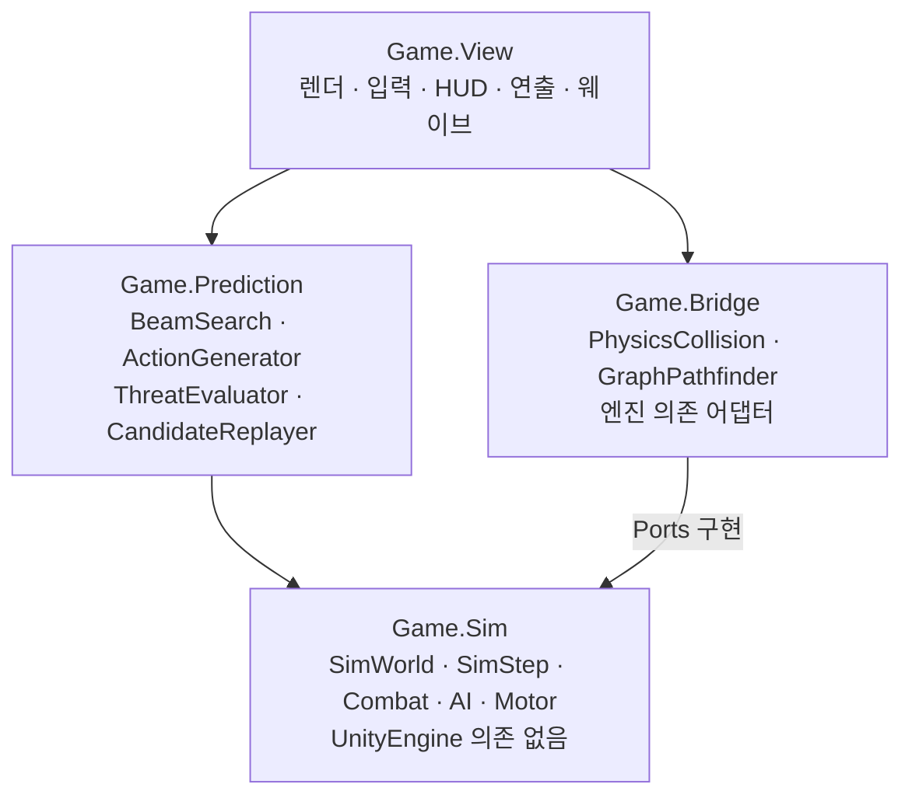

폴더 구조도 같은 경계를 그대로 따릅니다.

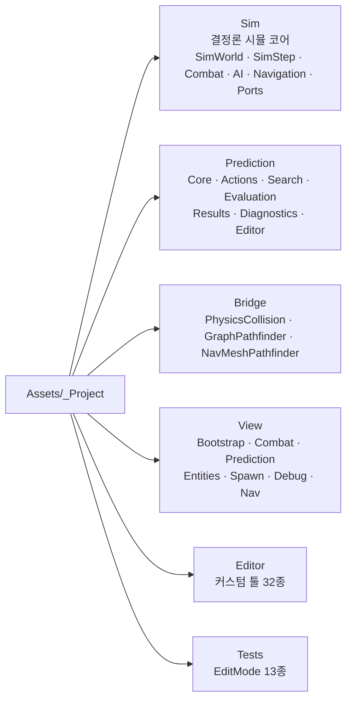

### 4.2 사용된 스택

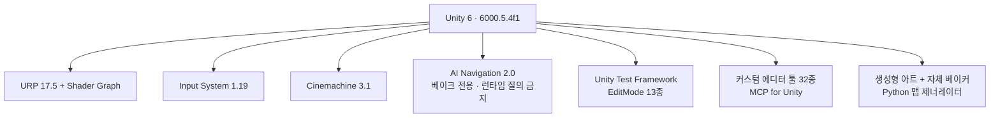

---

## 5. 알고리즘 원리

### 5.0 한 장 요약

**핵심 한 줄** — 가능한 미래를 전부 펼치면 1.2×10²⁴이지만, 매 단계마다 상위 12개만 남기고 나머지를 즉시 버리면 3,665개로 끝납니다.

#### Beam Search란

너비 우선 탐색(BFS)과 같은 방식으로 트리를 한 층씩 내려가되, **각 층에서 점수 상위 k개(빔 폭)만 남기고 나머지 가지는 그 자리에서 잘라내는** 탐색입니다. 최적해를 보장하지는 않지만, 트리가 지수로 커지는 문제를 층마다 폭을 고정하는 것으로 막습니다.

아래는 이해를 위해 **빔 폭 3 · 행동 3종 · 깊이 3**으로 축소한 예시입니다. 초록이 살아남은 노드, 회색 점선이 그 자리에서 잘려나간 가지, 파랑이 최종 선택된 경로입니다. (실제 게임은 빔 폭 12 · 행동 16종 · 깊이 20입니다.)

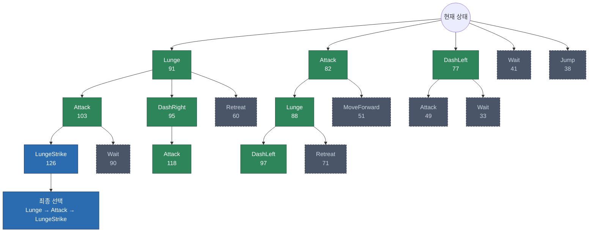

층마다 벌어지는 일은 항상 같습니다.

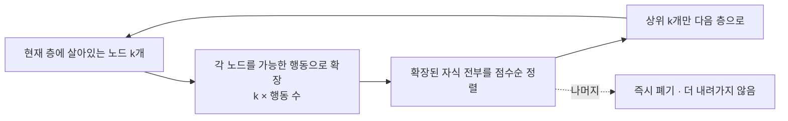

트리 폭이 `k`로 고정되므로, 깊이가 20이 되어도 총 노드 수는 깊이에 **비례**해서만 늘어납니다. 이 게임에 적용한 실제 규모가 아래 그림입니다.

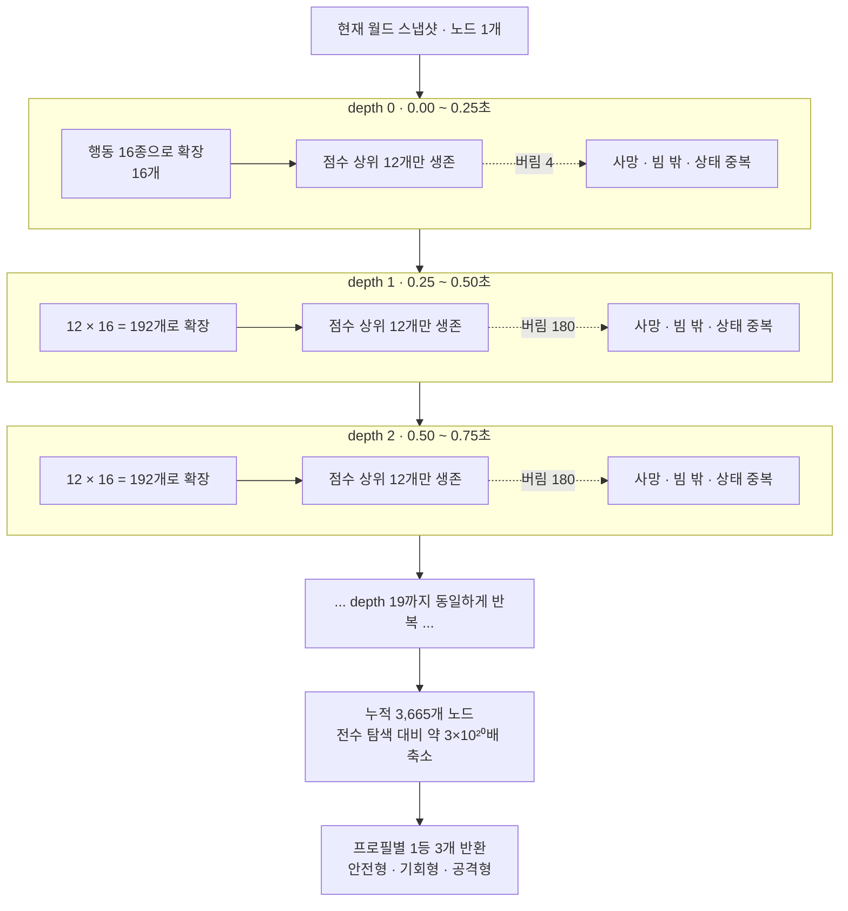

**알고리즘 순서표** — 예지 한 번에 실행되는 8단계입니다.

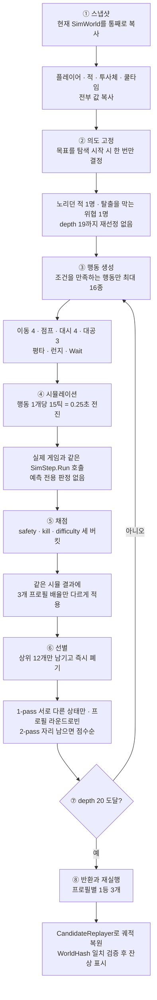

**결과가 신뢰할 만한가** — 가중치를 실험적으로 검증한 방법은 5.10에 있습니다. 안전형 기준, 관측축 감사와의 불일치율을 75%에서 25%까지 낮췄습니다.

---

### 5.1 매크로 행동 단위

탐색의 최소 단위는 1틱이 아니라 15틱(0.25초)짜리 매크로 행동입니다. 한 칸을 고르면 그 안의 15틱 입력이 전부 결정됩니다.

```mermaid
gantt
    title 매크로 행동 1칸이 InputCmd 15개로 펼쳐지는 구조
    dateFormat X
    axisFormat %s틱
    section depth 0 · LungeStrike
    t0 우클릭 · 런지 개시      :crit, 0, 1
    t1~t8 이동 유지            :active, 1, 9
    t9 좌클릭 · 착지 후 평타   :crit, 9, 10
    t10~t14 후딜               :10, 15
    section depth 1 · Attack
    t0 좌클릭                  :crit, 15, 16
    t1~t14 입력 없음           :16, 30
    section depth 2 · DashLeft
    t0 대시                    :crit, 30, 31
    t1~t14 이동                :active, 31, 45
```

전체 지평은 300틱, 즉 매크로 20칸입니다. 이렇게 펼쳐진 InputCmd는 실제 게임이 쓰는 함수에 그대로 들어갑니다. 예측 전용 판정을 만들지 않는다는 제1원칙이 구조로 강제되는 지점입니다.

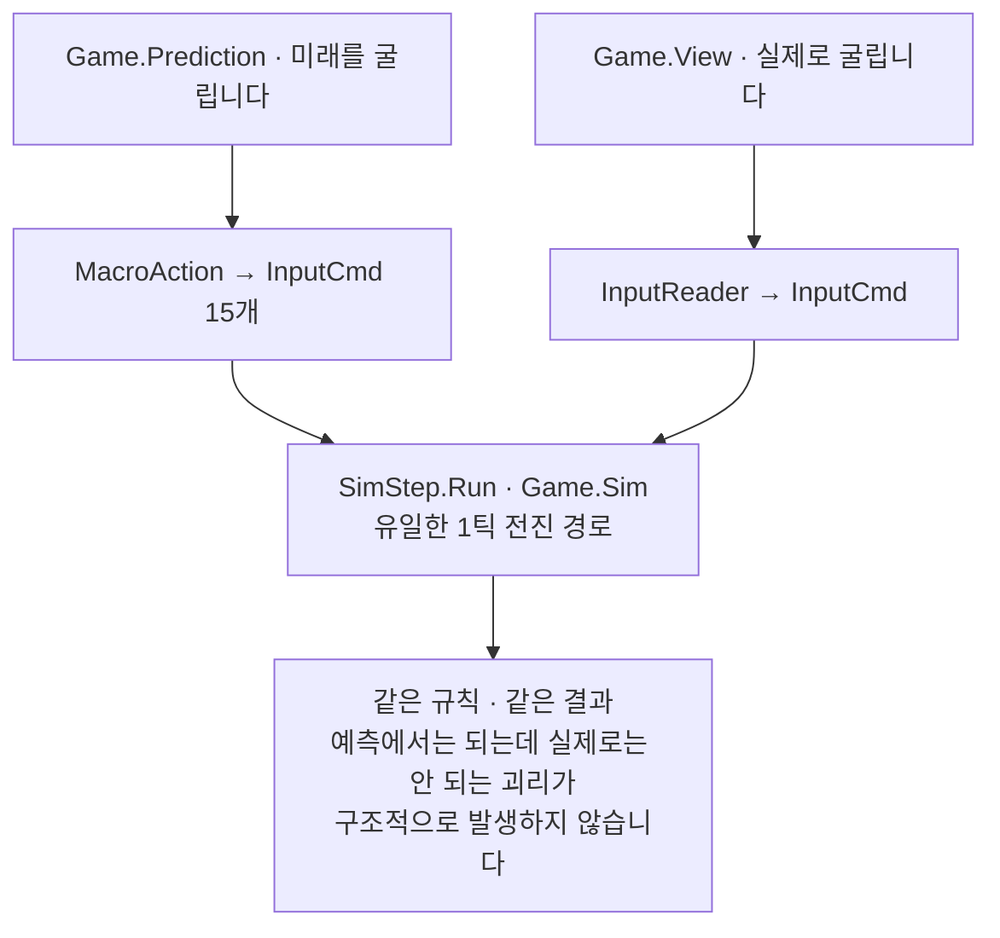

### 5.2 탐색 공간 규모

깊이가 한 칸 늘 때마다 경우의 수가 16배씩 늘어납니다. 전수 탐색과 Beam Search의 누적 노드 수를 로그 스케일로 비교하면 차이가 그대로 드러납니다.

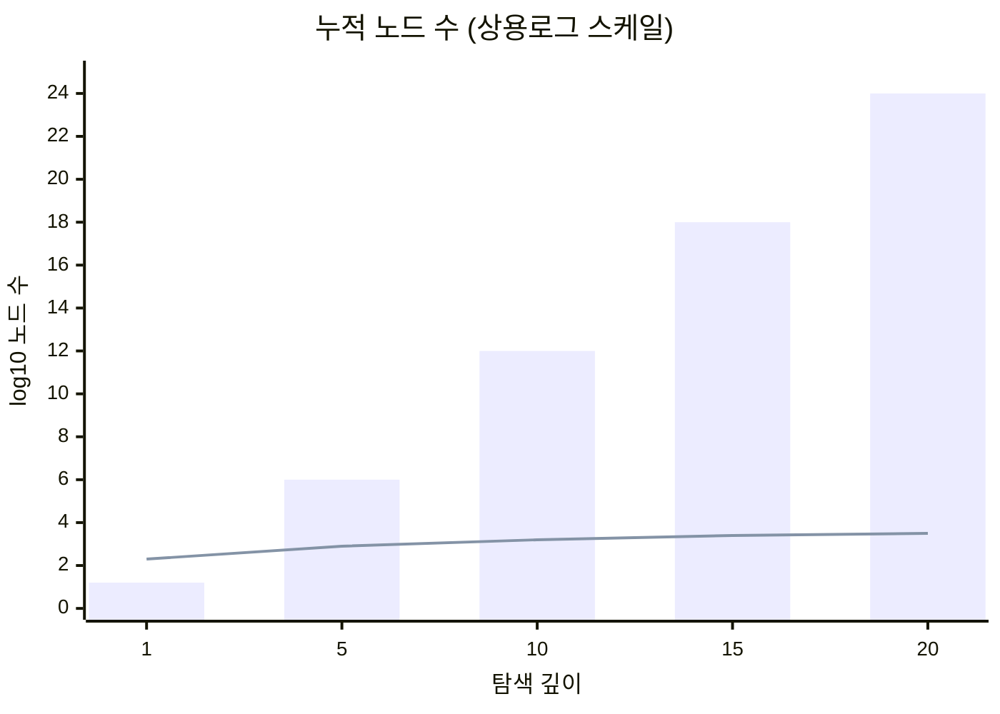

막대가 전수 탐색, 선이 Beam Search입니다. 누적 노드 수는 `1 + 16 + 192 × (depth − 1)`이고 depth 20에서 3,665가 됩니다.

### 5.3 depth 1회 처리 흐름

```mermaid
flowchart TD
  IN["빔에 남은 노드 12개"] --> LOOP["각 노드마다 반복"]
  LOOP --> G1["ActionGenerator<br/>조건 만족하는 행동만 최대 16개 생성"]
  G1 --> G2["행동마다 WorldBufferPool에서<br/>월드 버퍼를 하나 빌림"]
  G2 --> G3["15틱 시뮬 · SimStep.Run × 15"]
  G3 --> G4["시뮬 결과 하나로<br/>3개 프로필 각각 채점"]
  G4 --> Q["자식 노드 큐 · 최대 192개"]
  Q --> P1["1-pass<br/>상태 키가 서로 다른 것만<br/>슬롯 p는 프로필 p mod 3 기준 최고점"]
  P1 -->|12칸 안 참| P2["2-pass<br/>중복 상태 허용<br/>순수 점수순으로 채움"]
  P1 -->|12칸 참| OUT["다음 depth의 빔 · 정확히 12개"]
  P2 --> OUT
  P1 -.탈락.-> RET["WorldBufferPool 반환"]
  P2 -.탈락.-> RET
```

### 5.4 2-pass 선별 · 경로 다양성

단순히 점수 상위 12개만 뽑으면 빔이 거의 같은 상태로 몰립니다. 좋은 자리 하나를 찾으면 그 근처 미세 변형 12개가 빔을 독점하고, 전혀 다른 전략은 한 번도 탐색되지 못합니다.

```mermaid
flowchart TB
  subgraph BAD["단순 점수 상위 12"]
    direction LR
    b1["A 근처"] --- b2["A 근처"] --- b3["A 근처"] --- b4["A 근처"]
    b5["A 근처"] --- b6["A 근처"] --- b7["A 근처"] --- b8["A 근처"]
    BADR["결과: 세 프로필이 결국 같은 경로를 냄"]
  end
  subgraph GOOD["2-pass 선별 + 프로필 라운드로빈"]
    direction LR
    g1["A 지점"] --- g2["B 지점"] --- g3["C 지점"] --- g4["D 지점"]
    g5["E 지점"] --- g6["F 지점"] --- g7["G 지점"] --- g8["H 지점"]
    GOODR["결과: 세 프로필이 각자 다른 미래를 찾음"]
  end
  BAD --> GOOD
```

빔 슬롯 12칸은 세 프로필에 라운드로빈으로 배분합니다. 한 프로필이 나머지 두 목적의 후보를 전부 밀어내지 못하게 하는 장치입니다.

```mermaid
flowchart LR
  s0["슬롯0<br/>안전"] --> s1["슬롯1<br/>기회"] --> s2["슬롯2<br/>공격"] --> s3["슬롯3<br/>안전"] --> s4["슬롯4<br/>기회"] --> s5["슬롯5<br/>공격"]
  s5 --> s6["슬롯6<br/>안전"] --> s7["슬롯7<br/>기회"] --> s8["슬롯8<br/>공격"] --> s9["슬롯9<br/>안전"] --> s10["슬롯10<br/>기회"] --> s11["슬롯11<br/>공격"]
```

### 5.5 상태 중복 제거

탐색을 줄이는 두 번째 축은 비슷한 상태를 하나로 뭉치는 것입니다. 위치와 각도를 격자로 양자화해 FNV-1a 해시 키를 만들고, 키가 같으면 점수 높은 쪽만 남깁니다.

```mermaid
flowchart TB
  subgraph CASE1["좌표가 달라도 뭉칩니다"]
    A["노드 A<br/>pos 3.12, 7.48 · yaw 41.2도<br/>dashCd 34틱 · jumpCount 1"] --> KA["키 계산"]
    B["노드 B<br/>pos 3.31, 7.22 · yaw 47.9도<br/>dashCd 38틱 · jumpCount 1"] --> KA
    KA --> KR1["0.5m 격자 · 22.5도 격자 · 10틱 버킷<br/>같은 키 → 점수 높은 쪽만 생존"]
  end
  subgraph CASE2["좌표가 같아도 안 뭉칩니다"]
    C["노드 C<br/>pos 3.12, 7.48 · yaw 41.2도<br/>jumpCount 0 · 점프 잔량 2"] --> KB["키 계산"]
    D["노드 D<br/>pos 3.12, 7.48 · yaw 41.2도<br/>jumpCount 2 · 점프 잔량 0"] --> KB
    KB --> KR2["jumpCount가 키에 포함<br/>다른 키 → 둘 다 생존"]
  end
```

```mermaid
flowchart TB
  subgraph M["뭉칩니다 · 양자화"]
    M1["위치 x, y, z → 0.5m 격자"]
    M2["요 각도 → 22.5도 격자"]
    M3["쿨타임 · 투사체 TTL → 10틱 버킷"]
  end
  subgraph K["절대 안 뭉칩니다"]
    K1["처치 수 · HP · 대시 잔량"]
    K2["jumpCount · grounded"]
    K3["평타 / 런지 / 글로리 위상"]
    K4["적 상태 · 적 HP · 층 id · 투사체 존재"]
  end
```

> `jumpCount`를 키에 넣기 전에 한 번 크게 틀렸습니다. 같은 좌표라도 점프 잔량이 남은 분기와 다 쓴 분기가 하나로 뭉치면서, 마지막 고도 갭을 메울 점프가 남은 쪽이 버려졌습니다. 그 결과 공중 타겟팅 시퀀스가 통째로 끊겼고 원인을 찾는 데 한참 걸렸습니다. 탐색 공간을 줄이는 일이 곧 무엇을 같다고 볼 것인가를 정하는 일이라는 걸 여기서 배웠습니다.

### 5.6 행동 후보 16종 · 동률 해소

`ActionGenerator`는 우선순위 배열 순서대로, 조건을 만족하는 행동만 채웁니다. 그리고 이 생성 순서 자체가 동률 해소의 최종 기준입니다.

```mermaid
flowchart TB
  GEN["ActionGenerator<br/>우선순위 순으로 채움 · 캡 16"] --> L1["1~4 · 이동 4방향<br/>항상 · 난이도 0.25"]
  L1 --> L2["5 · Jump<br/>미대시 · 미경직 · jumpCount 2 미만 · 0.8"]
  L2 --> L3["6 · TerrainLeap<br/>도주 길찾기가 JumpUp 반환 · 2.2"]
  L3 --> L4["7 · AerialAscent<br/>사거리 밖 공중적 아래 발판 · 1.0"]
  L4 --> L5["8~11 · Dash 4방향<br/>대시 중 아님 · 충전 잔량 · 1.0"]
  L5 --> L6["12 · JumpStrike<br/>공중 슈터 높이차 2.6m 안 · 1.7"]
  L6 --> L7["13 · AerialPursuit<br/>지상 · 점프잔량 · 런지쿨 0 · LOS · 3.2"]
  L7 --> L8["14 · Attack<br/>부채꼴 3.25m 안 대상 존재 · 0.5"]
  L8 --> L9["15 · Lunge / LungeStrike<br/>CanLunge 통과 대상 최대 2 · 1.2 / 2.0"]
  L9 --> L10["16 · Wait<br/>연속 1회까지 · 0"]
```

```mermaid
flowchart TD
  T0["두 후보 비교"] --> T1{"점수 차가 1e-5 초과"}
  T1 -->|예| W1["큰 쪽 승"]
  T1 -->|아니오| T2{"연속 Wait 수가 다른가"}
  T2 -->|예| W2["적은 쪽 승"]
  T2 -->|아니오| T3{"총 Wait 수가 다른가"}
  T3 -->|예| W3["적은 쪽 승"]
  T3 -->|아니오| W4["먼저 생성된 쪽 승<br/>= 위 우선순위 순서"]
```

> 원래 설계 계약은 Wait를 우선순위 맨 앞에 두고 있었습니다. 그랬더니 아직 아무 일도 안 일어난 초기 동점 상황에서 항상 Wait가 이겼고, 적이 처음부터 사거리 밖인 시나리오에서 예지가 아예 접근하지 않는 회귀가 나왔습니다. Wait만 맨 뒤로 보내고 전술적 근거 없는 연속 Wait는 1회 초과 금지 규칙을 추가해 해결했습니다. 탐색에서 동률 해소 순서가 곧 게임의 성격이 된다는 걸 확인한 사례입니다.

### 5.7 평가 함수 · 관측과 가중치 분리

점수 코드가 월드를 직접 훑지 않습니다. 관측자가 가중치 없는 순수 수치를 뽑고, 평가기가 거기에 가중치만 곱합니다. 프로필은 새 공식을 만들지 않고 배율만 바꿉니다.

```mermaid
flowchart TD
  W["월드 · 매크로 실행 후"] --> OB1["FutureThreatObserver<br/>투사체 명중까지 틱 · 차지 명중까지 틱<br/>조준 중 공중적 수 · 사거리 내 공중적 수"]
  W --> OB2["OpportunityObserver<br/>처형 임박 대형몹 · 런지 가능 적<br/>측후방 확보 원거리 · 자원 잔량"]
  OB1 --> EV["ThreatEvaluator<br/>가중치만 곱합니다"]
  OB2 --> EV
  EV --> S["safety 버킷<br/>HP · 최근접 거리 · 포위<br/>위협 임박 감점 · 종료 위치 품질"]
  EV --> K["kill 버킷<br/>처치 · 피해 · 등반 진행도<br/>의도 진행도 · 기회 보너스"]
  EV --> D["difficulty 버킷<br/>누적 조작 난이도 · 음수"]
  S -->|safetyMul| TOT["Total = safety + kill + difficulty<br/>빔 정렬은 이 합으로만"]
  K -->|killMul| TOT
  D -->|difficultyPenaltyMul| TOT
```

이 분리가 5.10의 튜닝 방법론을 가능하게 합니다. 가중치를 전혀 건드리지 않고도 원값 진단 로그를 뽑을 수 있기 때문입니다.

미래 위험은 지금 맞았나가 아니라 몇 틱 뒤에 맞나로 점수화합니다. 임박할수록 감점이 선형으로 커집니다.

```mermaid
xychart-beta
    title "명중까지 남은 틱에 따른 위협 감점"
    x-axis "명중까지 남은 틱" [0, 10, 20, 30, 40, 45, 60, 70]
    y-axis "감점" -240 --> 0
    line [-135, -105, -75, -45, -15, 0, 0, 0]
    line [-240, -200, -160, -120, -80, -60, 0, 0]
```

위쪽 선이 투사체(틱당 −3, 지평 45틱), 아래쪽 선이 차지 돌진(틱당 −4, 지평 60틱)입니다.

사망은 `safety = −10000`인 유한한 센티널입니다. 음의 무한대로 두지 않은 이유는 전멸 상황에서도 후보끼리 순위를 매겨 가장 덜 나쁜 경로를 폴백으로 보여줘야 하기 때문입니다. 단 여기에는 프로필 배율을 곱하지 않습니다. 곱하면 프로필마다 사망 점수의 크기가 달라져 폴백 비교가 왜곡됩니다.

### 5.8 프로필 · 의도 고정

```mermaid
xychart-beta
    title "프로필별 배율 · 세 항목 비교"
    x-axis ["안전형", "기회형", "공격형"]
    y-axis "배율" 0 --> 3
    bar [2.0, 1.0, 0.35]
    line [0.3, 0.6, 2.2]
    line [2.8, 1.2, 0.15]
```

막대가 safetyMul, 첫 번째 선이 killMul, 두 번째 선이 종료 위치 배율입니다. 난이도 패널티는 각각 0.8 / 1.8 / 0.1입니다.

안전형이 killMul을 0으로 두지 않은 것은 정체를 막기 위해서고, 공격형이 safetyMul을 0으로 두지 않은 것은 확실한 즉사를 무시하지 않게 하기 위해서입니다. 안전형에는 탈출을 막는 핵심 위협을 제거하면 +50이라는 유일한 공격 동기가 따로 붙어 있습니다.

탐색 시작 시점에 목표를 한 번 못 박는 것도 경로 품질에 크게 작용했습니다. 도중에 목표가 바뀌면 경로가 산만해지기 때문입니다.

```mermaid
flowchart LR
  W["탐색 시작 · 월드 스냅샷"] --> I1["PlayerIntent<br/>플레이어가 노리던 적 1명<br/>facing×18 − min 거리,20<br/>한 방 컷이면 +8"]
  W --> I2["SafetyIntent<br/>탈출을 막는 핵심 위협 1명<br/>조준 중 공중적 +200<br/>윈드업 · 돌진 +140 · 5m 내 +60"]
  I1 --> L["depth 0부터 19까지 고정<br/>재선정 없음"]
  I2 --> L
```

### 5.9 결과 반환과 폴백

어떤 경우에도 최소 1개는 반환합니다. UI가 후보 없음을 처리할 필요가 없게 만들기 위해서입니다.

```mermaid
flowchart TD
  A{"마지막 빔에 생존 후보가 있는가"} -->|예| B["프로필별 1등 3개 반환"]
  A -->|아니오| C{"더 얕은 depth에 최선이 있는가"}
  C -->|예| D["bestOverallNode 1개 반환"]
  C -->|아니오| E{"사망 후보가 있는가"}
  E -->|예| F["가장 덜 나쁜 사망 후보<br/>isDeadFallback = true"]
  E -->|아니오| G["루트 스냅샷 그대로 반환"]
```

### 5.10 가중치 실험 검증

평가 함수에는 20개가 넘는 가중치가 있습니다. 인게임에서 눈으로 보며 조정하면 고쳤더니 딴 데가 터지는 늪에 빠지고, 무엇보다 좋아졌는지 나빠졌는지를 증명할 수가 없습니다. 그래서 오프라인 실험 하네스를 따로 만들었습니다.

```mermaid
flowchart TD
  F["① 고정 시나리오 픽스처<br/>결정론적 월드 스냅샷 8개"] --> R["② 가중치를 한 겹씩 켜며 반복 실행<br/>4단계 × 시나리오 × 10회"]
  R --> C["③ 후보 3개씩 전부 기록<br/>480행 · 39개 컬럼 CSV / JSON"]
  C --> AU["④ 관측축 감사<br/>점수와 독립된 기준으로 재정렬"]
  AU --> CMP{"⑤ Beam 1위가 감사 추천과 같은가"}
  CMP -->|일치| OK["가중치가 관측과 정합"]
  CMP -->|불일치| NG["auditReason 기록<br/>예: 종료 안전도와 퇴로 우세"]
  NG --> FIX["⑥ 가중치 재조정 후 다시 ②로"]
  FIX --> R
  OK --> M["불일치율 = 가중치 품질 지표"]
```

**① 고정 시나리오 픽스처.** 손으로 짠 결정론적 월드 스냅샷을 박아뒀습니다. 매번 같은 초기 상태에서 같은 탐색을 돌리므로, 달라진 것은 오직 가중치뿐입니다.

```mermaid
flowchart LR
  subgraph SF["안전형 픽스처 · S-v2-dense"]
    S1["S1 · 양측 포위<br/>저체력 탈출구 차단 적"]
    S2["S2 · 지상 추격대<br/>좌측 고지대 JumpUp 탈출"]
    S3["S3 · 교차 투사체<br/>정면 돌진의 사선 이탈"]
    S4["S4 · 조준 중 공중 위협 제거 후<br/>지상 포위 이탈"]
  end
  subgraph AF["공격형 픽스처 · A-v2-complex"]
    A1["A1 · 정면 12마리 밀집<br/>후방 유인 4"]
    A2["A2 · 다층 공중 4<br/>지상 군집 8"]
    A3["A3 · 저체력 연계 통로<br/>양측 군집 14"]
    A4["A4 · 양옆 포위 18<br/>중앙 공격 임박 강적"]
  end
```

**② 가중치를 한 겹씩 켭니다.** 한 번에 전부 켜면 어느 항목이 효과를 냈는지 알 수 없습니다. 그래서 누적 단계로 켜며 동일 시나리오를 반복합니다.

```mermaid
flowchart LR
  S0["0-baseline<br/>순수 safety / kill만"] --> S1["1-terminal<br/>+ 종료 위치 품질"]
  S1 --> S2["2-difficulty<br/>+ 조작 난이도 패널티"]
  S2 --> S3["3-current-final<br/>+ 최종 프로필"]
```

**④ 관측축 감사.** 핵심은 이것입니다. 점수를 점수로 검증하면 순환논법입니다. 그래서 점수와 완전히 독립적인 관측축 사전식 비교를 따로 두고, 그 기준이 고른 후보와 Beam 1위가 일치하는지를 봤습니다.

```mermaid
flowchart TD
  CAND["같은 후보 3개"] --> PA["경로 A<br/>Beam Search 점수순 정렬"]
  CAND --> PB["경로 B<br/>관측축 사전식 정렬"]
  PB --> AX1["안전형 축<br/>예상피격 감소 → 종료안전도 → 종료포위 감소<br/>→ 즉시행동 → 처치 → 난이도 감소"]
  PB --> AX2["공격형 축<br/>주목대상 진척 → 처치 → 피해<br/>→ 예상피격 감소 → 즉시행동 → 종료품질"]
  PA --> WA["Beam 1위"]
  AX1 --> WB["감사 추천"]
  AX2 --> WB
  WA --> CMP{"두 1위가 같은가"}
  WB --> CMP
  CMP -->|같음| OK["정합"]
  CMP -->|다름| NG["불일치 · 사유 기록"]
```

**⑤ 결과.** 안전형 S1~S4 × 10회 반복 = 40회 기준의 불일치율입니다.

```mermaid
xychart-beta
    title "Beam 1위와 관측축 추천의 불일치율 · 낮을수록 좋음"
    x-axis ["0-baseline", "1-terminal", "2-difficulty", "3-final"]
    y-axis "불일치율 (%)" 0 --> 80
    bar [75, 50, 25, 25]
```

순수 safety/kill만으로는 네 번 중 세 번, 사람이 봐도 이상한 경로를 1위로 뽑았습니다. 종료 위치 품질을 넣자 절반으로, 조작 난이도 패널티까지 넣자 4분의 1로 떨어졌습니다. 남은 25%는 감사축과 점수의 우선순위 차이(대부분 탈출에 필요한 위협 제거)였고, 개별 확인 결과 의도된 차이였습니다.

같은 로그에서 결정론도 함께 증명됐습니다. `replayValid`가 480행 전부 True입니다. 탐색이 뽑은 액션 시퀀스를 다시 실행하면 월드 해시가 일치한다는 뜻입니다.

```mermaid
flowchart LR
  BS["BeamSearch"] --> AC["CandidatePath.actions"]
  AC --> RP["CandidateReplayer<br/>같은 스냅샷에서 재실행"]
  RP --> H1["worldHashAfterReplay"]
  BS --> H2["탐색 종료 시 월드 해시"]
  H1 --> CMP{"두 해시가 같은가"}
  H2 --> CMP
  CMP -->|480행 전부 True| OK["예측대로 실행됨이 보장"]
  CMP -->|하나라도 False| NG["비결정론 유입 · 즉시 조사"]
```

### 5.11 성능 축소 규칙

같은 로그에서 탐색 시간도 함께 측정됐고, 여기서 축소 규칙이 나왔습니다.

```mermaid
xychart-beta
    title "시나리오별 탐색 시간 · 에디터 계측 · Full 프리셋 · 축소 미적용"
    x-axis ["A2 적12", "A3 적14", "A1 적16", "A4 적18"]
    y-axis "밀리초" 0 --> 800
    bar [342, 459, 664, 672]
    line [300, 300, 300, 300]
```

선이 300ms 하드리밋입니다. 경과 시간으로 품질을 낮추면 같은 스냅샷이라도 컴퓨터 성능에 따라 다른 설정이 걸리고, 결과가 달라져 결정론이 깨집니다. 그래서 판단 기준을 적 수 하나로 고정했습니다.

```mermaid
xychart-beta
    title "적 수에 따른 결정론적 축소"
    x-axis ["16 이하", "17~31", "32~49", "50 이상"]
    y-axis "값" 0 --> 22
    bar [12, 8, 6, 6]
    line [20, 20, 13, 10]
    line [16, 16, 16, 16]
```

막대가 beamWidth, 첫 번째 선이 macroDepth, 평평한 선이 maxActions입니다. `maxActionsPerNode`만 절대 건드리지 않는 이유는 5.6의 우선순위표에 있습니다. 이동 4종과 점프, 대시 4종이 먼저 캡을 채우기 때문에 캡을 낮추면 14번째인 Attack과 그 뒤의 Lunge, Wait가 후보 생성 단계에서 통째로 사라집니다.

```mermaid
flowchart LR
  CAP["캡을 16에서 9로 낮추면"] --> IN["캡 안에 들어가는 것<br/>이동 4종 · 점프 · 대시 4종"]
  CAP --> OUT["잘려 나가는 것<br/>TerrainLeap · AerialAscent<br/>JumpStrike · AerialPursuit<br/>Attack · Lunge · Wait"]
  OUT --> RES["예지가 도망만 다니고<br/>공격은 절대 하지 않는 상태가 됨"]
```

느린 것보다 공격이 후보에서 사라지는 것이 훨씬 심각하다고 판단했습니다.

### 5.12 결정론 규칙

결정론은 기능이 아니라 제약입니다. 아래 다섯 줄이 "예측한 대로 실행된다"를 지탱합니다.

```mermaid
flowchart TD
  D["결정론"] --> R1["탐색 루프에서<br/>벽시계 시간을 읽지 않습니다"]
  D --> R2["Physics · NavMesh 런타임 질의 금지<br/>베이크된 그래프만 조회합니다"]
  D --> R3["GameObject · LINQ · List 할당 없음<br/>고정 배열 + WorldBufferPool"]
  D --> R4["동률은 항상 생성 순서로 결정<br/>엄격한 비교 · 엡실론 1e-5"]
  D --> R5["WorldHash로 재실행 일치를<br/>테스트에 고정"]
```

내비게이션을 런타임 질의 대신 에디터 베이크 그래프로 바꾼 것이 두 번째 규칙의 핵심입니다. 층이동 링크(JumpUp / Drop)도 전부 베이크 시점에 확정되므로, 예측기가 물리 엔진을 건드리지 않고도 저 발판으로 올라갈 수 있는가를 판단할 수 있습니다.

---

## 6. 검증 도구

알고리즘이 눈에 안 보이는 게 가장 큰 문제였기 때문에, 개발 시간의 상당 부분을 진단 도구에 썼습니다.

```mermaid
flowchart LR
  V["검증 도구"] --> V1["PredictionVisualizer · 1,142줄<br/>탐색 트리 · 후보 궤적 시각화<br/>시나리오 로그 내보내기"]
  V --> V2["RouteDivergenceDiagnostic<br/>세 프로필 경로가 실제로 분기하는지"]
  V --> V3["AerialTargetingDiagnostic<br/>공중 타겟팅 후보 생성 추적"]
  V --> V4["PredictionProfiler<br/>월드복사 / 행동생성 / 시뮬 / 평가 / 중복제거"]
  V --> V5["EditMode 테스트 13종<br/>결정론 · Beam 스케일 · 중복제거<br/>재실행 · 프로필 · 축소 규칙"]
```

---

관련 문서 — [예지 알고리즘 해부](PREDICTION_ALGORITHM_OVERVIEW.md) · [예측 통합 계약](PREDICTION_CONTRACT.md) · [몹 시스템](ENEMY_SYSTEM.md)
