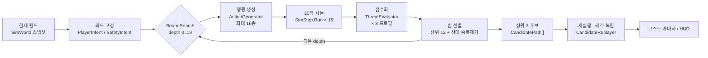
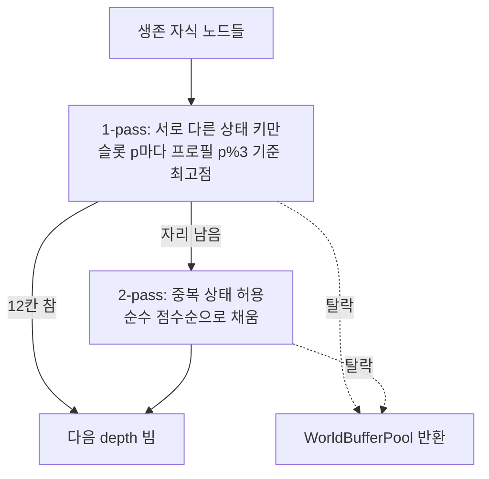
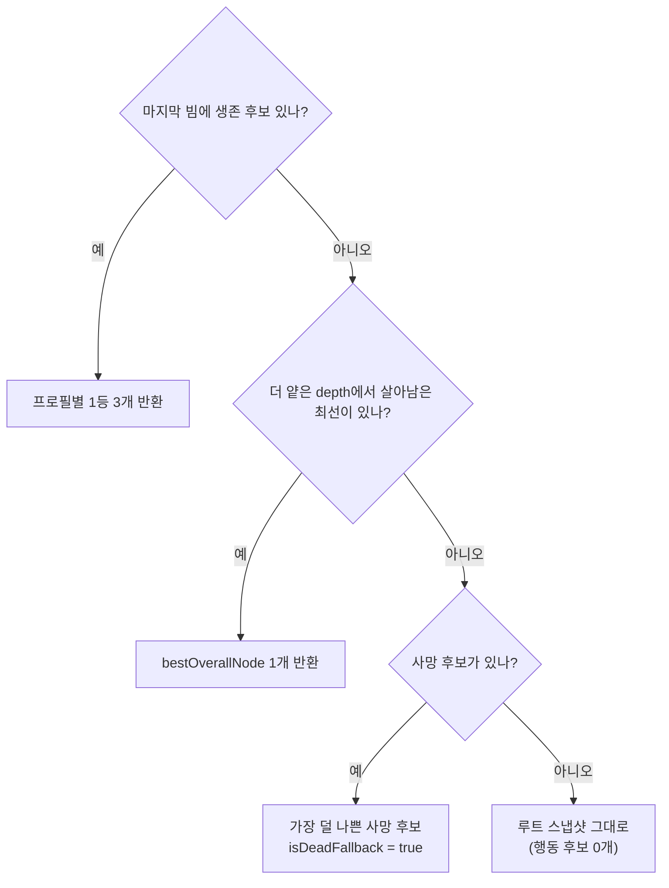

# 예지 알고리즘 해부 — 예측 시스템 정리

> 노션 붙여넣기용 요약본. 웹 버전(표·그래프 포함): 아티팩트 링크 참조.
> 기준: `prediction-route-diversity` 브랜치 / 2026-07-22 / `PrecogPrototype/Assets/_Project/`

---

## 0. 한 줄 요약

플레이어가 예지를 켜면 현재 월드를 통째로 복사해 **최대 5초 뒤**까지 결정론적으로 굴려보고,
서로 다른 성향의 **미래 3갈래(안전형·기회형·공격형)** 를 골라 보여준다.
그 3갈래를 고르는 것이 **Beam Search** — 폭 12, 깊이 20, 행동 후보 16종, 점수표 3벌.

| 항목 | 값 |
|---|---|
| 예측 지평 | 5.0초 / 300틱 |
| 매크로 스텝 | 15틱 = 0.25초 |
| 탐색 깊이 | 20 |
| 빔 폭 | 12 |
| 노드당 행동 후보 | 16 |
| 반환 경로 | 3 (프로필별 1등) |

**제1원칙**: 예측 전용 판정을 새로 만들지 않는다. 실제 게임 루프와 완전히 같은 `SimStep.Run()`을 호출하므로,
"예측에서는 되는데 실제로는 안 되는" 괴리가 구조적으로 생기지 않는다.

---

## 1. 전체 파이프라인



**월드 복사는 한 번, 채점은 세 번.** `RunSharedProfiles()`는 세 프로필이 같은 자식 월드 시뮬레이션을
공유하고 점수 계산만 세 벌 돌린다. 각 depth의 빔 슬롯 12칸은 세 프로필에 **라운드로빈**으로 배분해
한 프로필이 나머지 두 목적의 후보를 전부 밀어내지 못하게 한다.

---

## 2. 탐색 구조

### 프리셋

| 프리셋 | macroTicks | depth | beam | actions | 예측 시간 | 용도 |
|---|---:|---:|---:|---:|---:|---|
| `Mini` | 15 | 3 | 4 | 4 | 0.75s | 단위 테스트 |
| `Full` | 15 | 20 | 12 | 16 | 5.00s | 본탐색 기준값 |
| `ForDuration(t)` | 15 | t×60/15 | 12 | 16 | 1~5s | 예지 게이지 연동 (depth만 조절) |

### 가지치기 규모

- 전수 탐색: 16^20 ≈ **1.2 × 10²⁴** 노드
- Beam Search 누적: 17 + 192×(d−1) → 깊이 20에서 **3,665** 노드
- 배열 예산: `nodeCapacity = 1 + depth × beam × actions = 3,841`, `poolCapacity = beam × (actions+1) + 1 = 205`

즉 **3 × 10²⁰배 축소**. 빔 폭이 곧 품질/비용의 손잡이다.

### 노드가 사라지는 세 경로

1. **사망** — 빔 확장에서 제외. 단 전멸 폴백용으로 "가장 덜 나쁜" 후보 하나는 점수를 기억
2. **빔 밖 탈락** — 점수 미달, 월드 버퍼 즉시 반환
3. **상태 중복** — 양자화 해시 키가 같으면 1-pass에서 제외

---

## 3. 행동 후보 16종

`ActionGenerator.Generate()`가 우선순위 배열 순서대로 조건을 만족하는 것만 채운다.
**이 순서 자체가 Beam Search의 동률 해소 기준** — 같은 점수면 먼저 생성된 쪽이 이긴다.

| # | 행동 | 입력 패턴 (15틱 내) | 생성 조건 | 난이도 비용 |
|---:|---|---|---|---:|
| 1 | MoveForward | 전진 유지 | 항상 | 0.25 |
| 2 | MoveLeft | 좌 스트레이프 | 항상 | 0.25 |
| 3 | MoveRight | 우 스트레이프 | 항상 | 0.25 |
| 4 | Retreat | 후진 유지 | 항상 | 0.25 |
| 5 | Jump | t0 점프 | 미대시·미경직·jumpCount<2 | 0.8 |
| 6 | TerrainLeap | 전진 + t0·t7 점프 | 도주 방향 길찾기가 JumpUp 반환 | 2.2 |
| 7 | AerialAscent | 전진 + t0·t7 점프 | 사거리 밖 공중 적 아래 발판으로 JumpUp | 1.0 ※ |
| 8~11 | Dash 4방향 | t0 대시 | dashTicks=0 · dashCharges>0 | 1.0 |
| 12 | JumpStrike | t0 점프 → t≈9 좌클릭 | 조준/발사 중 공중 슈터가 높이차 2.6m 안 · 부채꼴 안 | 1.7 |
| 13 | AerialPursuit | 전진 + t0·t7 점프 → t11 우클릭 | 지상·jumpCount=0·런지 쿨 0·LOS 확보 | 3.2 |
| 14 | Attack | t0 좌클릭 | 부채꼴(3.25m / ±55°) 안 대상 존재 | 0.5 |
| 15 | Lunge / LungeStrike | t0 우클릭 (+착지 후 좌클릭) | `PlayerCombat.CanLunge` 통과 대상 최대 2 | 1.2 / 2.0 |
| 16 | Wait | 무입력 | 연속 1회까지 | 0 |

※ `AerialAscent`는 `ActionDifficulty` switch에 개별 case가 없어 default 1.0을 받는다 (튜닝 여지).

**난이도 비용 추가분**: 요 회전량 `|Δyaw| / 180`, 런지 대상 변경 시 `+1.5`.

> ⚠️ **Wait가 맨 뒤인 이유**
> 원래 계약(PREDICTION_CONTRACT 10장)은 Wait를 맨 앞에 뒀다. 그랬더니 "아직 아무 일도 안 일어난"
> 동점 상황에서 항상 Wait가 이겨, 적이 처음부터 사거리 밖인 시나리오에서 예지가 *아예 접근하지 않는*
> 회귀가 관측됐다. Wait만 맨 뒤로 옮기고 나머지 순서는 계약 그대로 유지.
> 추가로 전술적 근거 없는 **연속 Wait는 1회 초과 금지**.

---

## 4. 평가 함수 — 세 개의 버킷

모든 점수는 `safety` / `kill` / `difficulty` 중 하나로 들어가고, 빔 정렬은 그 합(`Total`)으로만 한다.
프로필은 **새 판정 공식을 만들지 않고** 이 세 버킷의 가중치만 바꾼다.

```
Total = safety + kill + difficulty

safety = min(hp, 3) × 10
       + min(최근접 적 거리, 6) × 1
       − max(0, 반경5m 내 적 수 − 4) × 2
       − 특수위협감점(투사체 · 차지 · 조준중 공중적 · 층이동)
       × profile.safetyMul  + [종료깊이] 종료위치품질 × terminalPositionMul

kill   = (처치 수 × 30 + 누적 피해 × 8
       + 사거리 내 공중 적 수 × 4
       + [닿는 공중적 0일 때] 등반진행도(0~1) × 6) × profile.killMul
       + 주목대상 진행도 × salientTargetMul
       + 핵심위협 제거(0|1) × criticalThreatRemovedBonus
       + [기회형·종료깊이] OpportunityBonus

diff   = − 누적 조작난이도 × difficultyPenaltyMul

사망   : safety = −10000 (배율 미적용 센티널), 즉시 반환
```

> **사망 점수를 −∞가 아니라 유한값으로 두는 이유**: 전멸 상황에서도 후보끼리 순위를 매겨
> "가장 덜 나쁜" 경로를 폴백으로 보여줄 수 있어야 한다. 단 프로필 배율은 곱하지 **않는다** —
> 곱하면 프로필마다 사망 점수 크기가 달라져 폴백 비교가 왜곡된다.

### 기본 가중치 (`PredictionScoreConfig`)

| 버킷 | 항목 | 가중치 | 포화 / 문턱 |
|---|---|---:|---|
| kill | 처치 1명 | **+30** | 대형몹은 `gloryStage>0` 시점에 즉시 인정 |
| kill | 피해 1 | **+8** | 매크로 전후 적 HP 총합 차 |
| kill | 사거리 내 공중적 1명 | +4 | 런지 사거리 1.2~7m · 높이차 ≤6m |
| kill | 대공 등반 진행도 | +6 ×(0~1) | 기준 갭 8m · 반경 25m · 닿는 적 없을 때만 |
| safety | 플레이어 HP 1칸 | **+10** | 3칸에서 포화 (개발용 무한체력 방어) |
| safety | 최근접 적 거리 1m | +1 | 6m에서 포화 |
| safety | 포위 초과 1명 | −2 | 반경 5m · 4명까지 허용 |
| safety | 투사체 명중 임박 | **−3 / 틱** | 지평 45틱, 임박할수록 선형 증가 (최대 −135) |
| safety | 차지 돌진 임박 | **−4 / 틱** | 지평 60틱 (최대 −240) |
| safety | 조준/발사 중 공중적 | −2 / 명 | 반경 10m · 단순 부유는 제외 |
| safety | 진행 중 층이동 | −0.5 / 개 | 적이 궤적에 묶인 상태 |
| safety | 사망 | **−10000** | 센티널 · 배율 미적용 |

### 종료 위치 품질 (안전형 주력)

마지막 depth에서만 계산 — 중간 자세를 반복 보상하면 "자세만 잡고 아무것도 안 하는" 경로가 이긴다.

| 항목 | 가중치 | 비고 |
|---|---:|---|
| 최근접 적 거리 | ×2 | 8m 포화 |
| 근접 적 초과(>2명) | −7 / 명 | 반경 5m |
| 고도 우위 | ×3 | 8m 내 적 대비, 0~4m clamp |
| 열린 탈출 섹터 | ×1.5 | 수평 8방향 중 안 막힌 수 (반경 7m) |
| 즉시 행동 가능 | +8 | 평타·런지 위상 모두 None |
| 접지 | +3 | |
| 대시 잔량 보유 | +2 | |
| 투사체 임박 | −12 | 45틱 이내 |
| 차지 임박 | −16 | 60틱 이내 |

### 기회 보너스 (기회형 전용)

"지금 때리는 양"이 아니라 "다음 1초에 강하게 때릴 수 있는 상태인가"를 점수화.
우선순위 **다음 처치 가능성 > 유리한 위치 > 자원 보존 > 현재 피해** 가 값 크기에 그대로 반영돼 있다.

| 가점 | 값 | | 감점 | 값 |
|---|---:|---|---|---:|
| Large 처형 임박 1명 | +40 | | 위험한 회복 중 조작 묶임 | −25 |
| 런지 가능 적 1명 | +25 | | 적 무리 중앙 종료 (초과 1명당) | −20 |
| 측·후방 잡은 원거리 1명 | +15 | | 이동 자원 전부 소진 | −15 |
| 고지대 확보 | +10 | | | |
| 즉시 행동 가능 | +10 | | | |
| 부채꼴 안 적 1명 | +8 | | | |
| 대시·런지 자원 보존 (각각) | +6 | | | |

종료 깊이에서만 가산한다 (중간 노드가 "행동을 아낀 것"만으로 보상받지 않도록).

---

## 5. 참조 변수 — 관측과 가중치의 분리

점수 코드가 월드를 직접 훑지 않는다. 관측자(`FutureThreatObserver`, `OpportunityObserver`)가
**가중치 없는 순수 수치**를 뽑고, 평가기가 거기에 가중치만 곱한다.

| 관측 필드 | 의미 | 쓰이는 곳 |
|---|---|---|
| `nearestProjectileImpactTicks` | 가장 이른 투사체 명중까지 틱 (최근접점 해석해) | safety 감점 · 종료위치 감점 |
| `nearestChargeImpactTicks` | 차지 몹 돌진선 위 명중까지 틱 (윈드업+주행) | safety 감점 · 종료위치 감점 |
| `aimingFlyingEnemyCount` | 반경 10m 내 *조준/발사 중* 공중 적 | safety 감점 |
| `strikeableFlyingEnemyCount` | 런지 사거리·높이차 안 공중 적 (마무리 기회) | kill 가점 +4 |
| `unreachableFlyingEnemyCount` | 높이차 >6m로 어떤 공중 액션도 안 닿는 적 | 등반 유도 스위치 |
| `aerialAscentProgress01` | 닿는 높이까지 얼마나 올라왔나 (0~1) | kill 가점 ×6 |
| `activeTraversalCount` | 층이동 궤적에 묶인 적 수 | safety 감점 |
| `attackWindupCount` | 윈드업/조준 중인 적 수 | 관측용 (현재 미가중) |
| `lungeableCount` | 사거리·높이 근사로 런지 가능해 보이는 적 | 기회 보너스 +25 |
| `executionReadyLargeCount` | 다음 한 대로 처형 진입하는 Large | 기회 보너스 +40 |
| `flankedRangedCount` | 정면 dot < 0.5 인 원거리 적 (측·후방 확보) | 기회 보너스 +15 |
| `lockedInDangerousRecovery` | 평타/런지로 조작 묶인 채 포위 초과 | 기회 보너스 −25 |

관측은 근사(LOS 생략 등)여도 되지만, 실제 발동 판정은 항상 실전 Sim 규칙(`PlayerCombat.CanLunge`)에 위임한다.

### 의도 고정 — 탐색 시작 시점에 딱 한 번

**PlayerIntentContext** — 시작 시 "플레이어가 노리고 있던" 적 하나를 고정.
선정식 `facing×18 − min(거리,20)`, 한 방에 죽는 적이면 +8.
이후 진행도 = `준 피해×5 + (처치 시 +24) + 접근량×1.5`.
목표가 도중에 바뀌지 않아 경로가 산만해지지 않는다.

**SafetyIntentContext** — 탈출을 막는 핵심 위협 하나를 고정.
선정식 `조준 중 공중적 +200 / 윈드업·돌진 +140 / 5m 내 +60 + facing×12 − 거리`.
그 적이 제거되면 안전형 kill 버킷에 **+50** — 안전형의 유일한 공격 동기.

---

## 6. 세 갈래 미래 — 프로필

`PlanByProfile()`은 항상 **안전형 · 기회형 · 공격형** 순서로 3개를 반환한다.
절충형(`Balanced`)은 하위 호환용으로만 남아 있고 실제 UI에는 안 쓴다.

| 프로필 | safetyMul | killMul | salient | terminalPos | diffPenalty | critThreat | 기회보너스 | 난이도 적용 |
|---|---:|---:|---:|---:|---:|---:|---|---|
| **안전형** | 2.0 | 0.3 | 0.7 | 2.8 | 0.8 | +50 | — | 종료깊이만 |
| **기회형** | 1.0 | 0.6 | 1.1 | 1.2 | 1.8 | 0 | 사용 | 매 깊이 |
| **공격형** | 0.35 | 2.2 | 0.1 | 0.15 | 0.1 | 0 | — | 종료깊이만 |
| 절충형(하위호환) | 1.0 | 1.0 | 0 | 0 | 0 | 0 | — | — |

안전형이 `killMul`을 0으로 두지 않는 것(정체 방지), 공격형이 `safetyMul`을 0으로 두지 않는 것
(확실한 즉사 무시 방지) 모두 의도적이다.

```csharp
public static readonly ScoreProfile Safe = new ScoreProfile(
    "안전형", safetyMul: 2f, killMul: 0.3f, minKillBonus: 0f, minKillThreshold: 0,
    salientTargetMul: 0.7f, terminalPositionMul: 2.8f, difficultyPenaltyMul: 0.8f,
    difficultyTerminalOnly: true, criticalThreatRemovedBonus: 50f);

public static readonly ScoreProfile Opportunistic = new ScoreProfile(
    "기회형", 1f, 0.6f, 0f, 0, useOpportunityBonus: true,
    salientTargetMul: 1.1f, terminalPositionMul: 1.2f, difficultyPenaltyMul: 1.8f);

public static readonly ScoreProfile Aggressive = new ScoreProfile(
    "공격형", 0.35f, 2.2f, 0f, 0,
    salientTargetMul: 0.1f, terminalPositionMul: 0.15f, difficultyPenaltyMul: 0.1f,
    difficultyTerminalOnly: true);
```

---

## 7. 빔 선별 — 2-pass 중복 제거

각 depth 끝에서 살아남은 자식 중 상위 12개만 남긴다. 단순 상위 12개를 뽑으면 빔이 거의 같은 상태로
몰려 다양성이 죽으므로 2-pass로 처리한다.



### 상태 키 양자화 (`StateDeduplicator`, FNV-1a)

정확값 기반인 `WorldHash`(결정론 검증용)와 목적이 다르다 — 이쪽은 **비슷한 상태를 일부러 뭉치기** 위한 것.

| 대상 | 양자화 |
|---|---|
| 위치 (x, y, z) | 0.5m 격자 |
| 요 각도 | 22.5° 격자 |
| 쿨타임 · 투사체 TTL | 10틱 버킷 |

**뭉치지 않는 것**: 처치 수, HP, 대시 준비 여부, **jumpCount**, **grounded**, 평타/런지/**글로리 위상**,
적 상태(Windup/Active/Aim/Fire/ChargeRun), 적 HP, gloryStage, 층 id, 투사체 존재.

> `jumpCount`·`grounded`를 키에 넣는 이유: 같은 좌표라도 "점프 잔량이 남은 분기"와 "다 쓴 분기"가
> 뭉치면 마지막 고도 갭을 메울 점프가 남은 쪽이 버려져 공중 타겟팅 시퀀스가 통째로 끊긴다.

### 동률 해소 규칙

```csharp
const float ScoreEpsilon = 1e-5f;
if (candidate.score > current.score + ScoreEpsilon) return true;
if (candidate.score < current.score - ScoreEpsilon) return false;
// 1차 타이브레이크: 연속 Wait가 적은 쪽
if (candidate.consecutiveWaitCount != current.consecutiveWaitCount)
    return candidate.consecutiveWaitCount < current.consecutiveWaitCount;
// 2차: 총 Wait가 적은 쪽
if (candidate.waitCount != current.waitCount)
    return candidate.waitCount < current.waitCount;
// 완전 동률 → false 유지 = 먼저 생성된 쪽(ActionGenerator 우선순위)이 승리
return false;
```

이 세 단계가 "같은 스냅샷이면 항상 같은 후보"를 보장한다.

---

## 8. 결과 반환과 폴백



어떤 경우에도 최소 1개는 반환한다 — UI가 "후보 없음"을 처리할 필요가 없다.

### CandidatePath 반환 계약

| 필드 | 내용 |
|---|---|
| `actions[]` | 루트→종료까지 매크로 행동 시퀀스 (재실행의 입력) |
| `killCount` / `damageDealt` / `expectedHits` | 경로 누적 전투 통계 |
| `safetyScore` / `killScore` / `difficultyScore` | 해당 프로필 기준 세 버킷 점수 |
| `rawExecutionDifficulty` | 가중치 곱하기 전 누적 조작 난이도 (진단용) |
| `rawSalientTargetProgress` | 주목 대상 진행도 원값 |
| `rawTerminalPositionQuality` | 종료 위치 품질 원값 |
| `initialSnapshotHash` / `mapVersion` | 재실행 시 스냅샷 일치 검증 |
| `isDeadFallback` | 전멸 폴백 여부 (UI 경고 표시) |
| `profileLabel` | "안전형" / "기회형" / "공격형" |

`raw*` 필드는 점수에 반영된 값이 아니라 **가중치 전 관측치**라, 프로필 튜닝 없이 진단 로그를 뽑을 수 있다.

---

## 9. 결정론과 성능 축소

### 결정론을 지키는 규칙

- 탐색 루프에서 **벽시계 시간을 읽지 않는다**
- Physics / NavMesh 런타임 질의 금지 (베이크 그래프만 조회)
- GameObject · LINQ · List 할당 없음 — 고정 배열 + `WorldBufferPool`
- 동률은 항상 생성 순서로 결정 (엄격한 `>` 비교)
- 같은 스냅샷 → 반복 실행 시 같은 후보 (테스트로 고정)

### 적 수에 따른 결정론적 축소 (`PredictionSettings.Degrade`)

**스톱워치가 아니라 적 수**로만 판단한다. 실제 걸린 시간 기준이면 같은 스냅샷이라도 컴퓨터 성능에
따라 다른 설정 → 다른 결과가 나와 결정론이 깨진다.

| 적 수 | beamWidth | macroDepth | maxActions | 비고 |
|---|---:|---:|---:|---|
| ≤ 16 | 12 | 20 | 16 | 기준값 |
| 17 ~ 31 | 8 | 20 | 16 | 빔만 축소 |
| 32 ~ 49 | 6 | 13 | 16 | 깊이 ×2/3 |
| ≥ 50 | 6 | 10 | 16 | 깊이 ×1/2 |

`maxActionsPerNode`는 **일부러 안 건드린다**. 우선순위상 이동4+점프+대시4가 먼저 캡을 채우므로,
cap을 낮추면 Attack(14번째)·Lunge·Wait가 후보 생성 단계에서 통째로 사라진다.
"느린 것"보다 "공격이 후보에서 사라지는 것"이 훨씬 심각하다.

### 알려진 한계

- EnemySimulationTier가 없는 현재, 적 32마리 이상에서 300ms 하드리밋을 완전히 보장하지 못함
- 기회 관측의 "엄폐 확보"·"층 이동 출구 확보"는 Sim에 해당 플래그·질의가 없어 관측 불가
- "고지대"는 순수 높이 비교로 근사

---

## 10. 소스 맵

경로는 전부 `PrecogPrototype/Assets/_Project/` 기준.

| 파일 | 줄 | 역할 |
|---|---:|---|
| `Prediction/Core/PredictionPlanner.cs` | 31 | 유일한 진입점 · Plan / PlanByProfile |
| `Prediction/Core/PredictionSettings.cs` | 110 | Mini / Full / ForDuration / Degrade |
| `Prediction/Search/BeamSearch.cs` | 542 | 탐색 본체 · 확장 · 선별 · 폴백 |
| `Prediction/Search/StateDeduplicator.cs` | 108 | 상태 양자화 해시 |
| `Prediction/Search/WorldBufferPool.cs` | 47 | 월드 버퍼 풀링 |
| `Prediction/Actions/ActionGenerator.cs` | 426 | 행동 후보 16종 생성 |
| `Prediction/Actions/MacroAction.cs` | 178 | 매크로 → InputCmd 변환 · 서브틱 콤보 |
| `Prediction/Evaluation/ThreatEvaluator.cs` | 202 | 세 버킷 점수화 |
| `Prediction/Evaluation/ScoreProfile.cs` | 337 | 프로필 · 의도 평가 · 난이도 |
| `Prediction/Evaluation/PredictionScoreConfig.cs` | 84 | 가중치 상수 전량 |
| `Prediction/Evaluation/FutureThreatObservation.cs` | 181 | 미래 위험 관측 |
| `Prediction/Evaluation/OpportunityObservation.cs` | 112 | 기회 관측 (기회형 전용) |
| `Prediction/Results/CandidatePath.cs` | 57 | 반환 계약 |
| `Prediction/Results/CandidateReplayer.cs` | 157 | 후보 재실행 · 궤적 복원 |
| `Sim/Core/SimStep.cs` | 169 | 실제 게임과 공유하는 1틱 전진 |

### 진단 도구

| 파일 | 역할 |
|---|---|
| `Prediction/Editor/PredictionVisualizer.cs` | 에디터에서 탐색 트리·후보 궤적 시각화 (1,142줄) |
| `Prediction/Editor/RouteDivergenceDiagnostic.cs` | 세 프로필 경로가 실제로 분기하는지(Fork 성립) 검증 |
| `Prediction/Diagnostics/AerialTargetingDiagnostic.cs` | 공중 타겟팅 후보 생성 여부 추적 |
| `Prediction/Core/PredictionProfiler.cs` | 월드복사 / 행동생성 / 시뮬 / 평가 / 중복제거 구간별 계측 |

---

*가중치 값은 전부 첫 튜닝 기준이며 실사용하며 조정 대상입니다.*
